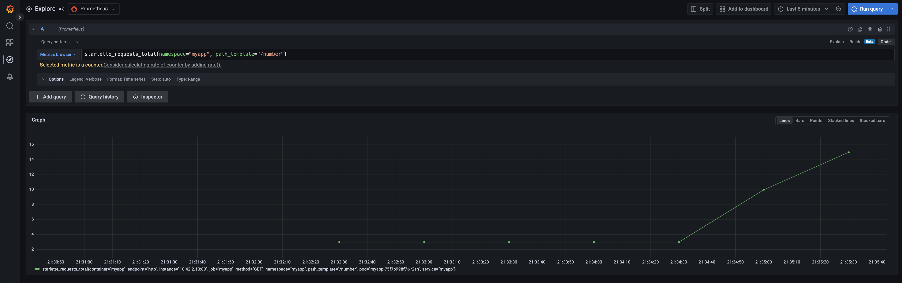

# observ-lab :eyes:
Simple observability lab 

## Main Idea

The idea of this lab is to have an application with white box instrumentation. 
To achive full experience, you must have installed:
- k3d
- docker
- helm3
- any web browser
- python3 + pip3
- terraform (at least v1.1.8)

## About the Application
Create a simple app with an API that returns random number between 0 and 999.

The web framework [fastapi](https://github.com/tiangolo/fastapi) was the choice.

### API Endpoints

| HTTP method   |      API endpoint      |  Description |
|----------|:-------------:|------:|
| GET |  /          | alive check (health)   |
| GET |  /number    | Get random numbers |
| GET |  /metrics   | Get some metrics   |


### Running locally
Probably some libs will be necessary:

```
pip3 install fastapi uvicorn starlette_prometheus
```

On app folder:
```
➜pwd                             
~/observ-lab/api/app
```

Run
```
uvicorn main:app --reloadls
```

You can test the applicaction via curl:
```
➜curl http://127.0.0.1:8000/number
{"Number":532}%
```

You can get some metrics also via curl:
```
curl http://127.0.0.1:8000/metrics
# HELP python_gc_objects_collected_total Objects collected during gc
# TYPE python_gc_objects_collected_total counter
python_gc_objects_collected_total{generation="0"} 361.0
python_gc_objects_collected_total{generation="1"} 279.0
python_gc_objects_collected_total{generation="2"} 0.0
# HELP python_gc_objects_uncollectable_total Uncollectable object found during GC
# TYPE python_gc_objects_uncollectable_total counter
python_gc_objects_uncollectable_total{generation="0"} 0.0
python_gc_objects_uncollectable_total{generation="1"} 0.0
python_gc_objects_uncollectable_total{generation="2"} 0.0
# HELP python_gc_collections_total Number of times this generation was collected
# TYPE python_gc_collections_total counter
python_gc_collections_total{generation="0"} 90.0
python_gc_collections_total{generation="1"} 8.0
python_gc_collections_total{generation="2"} 0.0
# HELP python_info Python platform information
# TYPE python_info gauge
python_info{implementation="CPython",major="3",minor="9",patchlevel="12",version="3.9.12"} 1.0
# HELP starlette_requests_total Total count of requests by method and path.
# TYPE starlette_requests_total counter
starlette_requests_total{method="GET",path_template="/"} 1.0
starlette_requests_total{method="GET",path_template="/random"} 1.0
starlette_requests_total{method="GET",path_template="/number"} 1.0
starlette_requests_total{method="GET",path_template="/metrics"} 1.0
# HELP starlette_requests_created Total count of requests by method and path.
# TYPE starlette_requests_created gauge
starlette_requests_created{method="GET",path_template="/"} 1.659442850481864e+09
starlette_requests_created{method="GET",path_template="/random"} 1.659442855022638e+09
starlette_requests_created{method="GET",path_template="/number"} 1.6594428614230342e+09
starlette_requests_created{method="GET",path_template="/metrics"} 1.65944291227379e+09
# HELP starlette_responses_total Total count of responses by method, path and status codes.
# TYPE starlette_responses_total counter
starlette_responses_total{method="GET",path_template="/",status_code="404"} 1.0
starlette_responses_total{method="GET",path_template="/random",status_code="404"} 1.0
starlette_responses_total{method="GET",path_template="/number",status_code="200"} 1.0
# HELP starlette_responses_created Total count of responses by method, path and status codes.
# TYPE starlette_responses_created gauge
starlette_responses_created{method="GET",path_template="/",status_code="404"} 1.659442850482643e+09
starlette_responses_created{method="GET",path_template="/random",status_code="404"} 1.659442855023309e+09
starlette_responses_created{method="GET",path_template="/number",status_code="200"} 1.65944286142465e+09
# HELP starlette_requests_processing_time_seconds Histogram of requests processing time by path (in seconds)
# TYPE starlette_requests_processing_time_seconds histogram
starlette_requests_processing_time_seconds_bucket{le="0.005",method="GET",path_template="/"} 1.0
starlette_requests_processing_time_seconds_bucket{le="0.01",method="GET",path_template="/"} 1.0
starlette_requests_processing_time_seconds_bucket{le="0.025",method="GET",path_template="/"} 1.0
starlette_requests_processing_time_seconds_bucket{le="0.05",method="GET",path_template="/"} 1.0
starlette_requests_processing_time_seconds_bucket{le="0.075",method="GET",path_template="/"} 1.0
starlette_requests_processing_time_seconds_bucket{le="0.1",method="GET",path_template="/"} 1.0
starlette_requests_processing_time_seconds_bucket{le="0.25",method="GET",path_template="/"} 1.0
starlette_requests_processing_time_seconds_bucket{le="0.5",method="GET",path_template="/"} 1.0
starlette_requests_processing_time_seconds_bucket{le="0.75",method="GET",path_template="/"} 1.0
starlette_requests_processing_time_seconds_bucket{le="1.0",method="GET",path_template="/"} 1.0
starlette_requests_processing_time_seconds_bucket{le="2.5",method="GET",path_template="/"} 1.0
starlette_requests_processing_time_seconds_bucket{le="5.0",method="GET",path_template="/"} 1.0
starlette_requests_processing_time_seconds_bucket{le="7.5",method="GET",path_template="/"} 1.0
starlette_requests_processing_time_seconds_bucket{le="10.0",method="GET",path_template="/"} 1.0
starlette_requests_processing_time_seconds_bucket{le="+Inf",method="GET",path_template="/"} 1.0
starlette_requests_processing_time_seconds_count{method="GET",path_template="/"} 1.0
starlette_requests_processing_time_seconds_sum{method="GET",path_template="/"} 0.0006748670000007451
starlette_requests_processing_time_seconds_bucket{le="0.005",method="GET",path_template="/random"} 1.0
starlette_requests_processing_time_seconds_bucket{le="0.01",method="GET",path_template="/random"} 1.0
starlette_requests_processing_time_seconds_bucket{le="0.025",method="GET",path_template="/random"} 1.0
starlette_requests_processing_time_seconds_bucket{le="0.05",method="GET",path_template="/random"} 1.0
starlette_requests_processing_time_seconds_bucket{le="0.075",method="GET",path_template="/random"} 1.0
starlette_requests_processing_time_seconds_bucket{le="0.1",method="GET",path_template="/random"} 1.0
starlette_requests_processing_time_seconds_bucket{le="0.25",method="GET",path_template="/random"} 1.0
starlette_requests_processing_time_seconds_bucket{le="0.5",method="GET",path_template="/random"} 1.0
starlette_requests_processing_time_seconds_bucket{le="0.75",method="GET",path_template="/random"} 1.0
starlette_requests_processing_time_seconds_bucket{le="1.0",method="GET",path_template="/random"} 1.0
starlette_requests_processing_time_seconds_bucket{le="2.5",method="GET",path_template="/random"} 1.0
starlette_requests_processing_time_seconds_bucket{le="5.0",method="GET",path_template="/random"} 1.0
starlette_requests_processing_time_seconds_bucket{le="7.5",method="GET",path_template="/random"} 1.0
starlette_requests_processing_time_seconds_bucket{le="10.0",method="GET",path_template="/random"} 1.0
starlette_requests_processing_time_seconds_bucket{le="+Inf",method="GET",path_template="/random"} 1.0
starlette_requests_processing_time_seconds_count{method="GET",path_template="/random"} 1.0
starlette_requests_processing_time_seconds_sum{method="GET",path_template="/random"} 0.0005281830000001264
starlette_requests_processing_time_seconds_bucket{le="0.005",method="GET",path_template="/number"} 1.0
starlette_requests_processing_time_seconds_bucket{le="0.01",method="GET",path_template="/number"} 1.0
starlette_requests_processing_time_seconds_bucket{le="0.025",method="GET",path_template="/number"} 1.0
starlette_requests_processing_time_seconds_bucket{le="0.05",method="GET",path_template="/number"} 1.0
starlette_requests_processing_time_seconds_bucket{le="0.075",method="GET",path_template="/number"} 1.0
starlette_requests_processing_time_seconds_bucket{le="0.1",method="GET",path_template="/number"} 1.0
starlette_requests_processing_time_seconds_bucket{le="0.25",method="GET",path_template="/number"} 1.0
starlette_requests_processing_time_seconds_bucket{le="0.5",method="GET",path_template="/number"} 1.0
starlette_requests_processing_time_seconds_bucket{le="0.75",method="GET",path_template="/number"} 1.0
starlette_requests_processing_time_seconds_bucket{le="1.0",method="GET",path_template="/number"} 1.0
starlette_requests_processing_time_seconds_bucket{le="2.5",method="GET",path_template="/number"} 1.0
starlette_requests_processing_time_seconds_bucket{le="5.0",method="GET",path_template="/number"} 1.0
starlette_requests_processing_time_seconds_bucket{le="7.5",method="GET",path_template="/number"} 1.0
starlette_requests_processing_time_seconds_bucket{le="10.0",method="GET",path_template="/number"} 1.0
starlette_requests_processing_time_seconds_bucket{le="+Inf",method="GET",path_template="/number"} 1.0
starlette_requests_processing_time_seconds_count{method="GET",path_template="/number"} 1.0
starlette_requests_processing_time_seconds_sum{method="GET",path_template="/number"} 0.0014887330000021848
# HELP starlette_requests_processing_time_seconds_created Histogram of requests processing time by path (in seconds)
# TYPE starlette_requests_processing_time_seconds_created gauge
starlette_requests_processing_time_seconds_created{method="GET",path_template="/"} 1.659442850482569e+09
starlette_requests_processing_time_seconds_created{method="GET",path_template="/random"} 1.659442855023223e+09
starlette_requests_processing_time_seconds_created{method="GET",path_template="/number"} 1.6594428614245682e+09
# HELP starlette_exceptions_total Total count of exceptions raised by path and exception type
# TYPE starlette_exceptions_total counter
# HELP starlette_requests_in_progress Gauge of requests by method and path currently being processed
# TYPE starlette_requests_in_progress gauge
starlette_requests_in_progress{method="GET",path_template="/"} 0.0
starlette_requests_in_progress{method="GET",path_template="/random"} 0.0
starlette_requests_in_progress{method="GET",path_template="/number"} 0.0
starlette_requests_in_progress{method="GET",path_template="/metrics"} 1.0
```

Or you can use swagger UI via broser:
`http://127.0.0.1:8000/docs`

### Building the application - Docker

Locking version
```
pip3 freeze > requirements.txt
```

Building
```
docker build -t myapp .
```

Running
```
docker run -d --name mycontainer -p 80:80 myapp
```


## Running k8 :anchor:

### k3d
Installing k3d 
https://k3d.io/v5.4.4/#installation

Create cluster
```
k3d cluster create observ --agents 6
```

### Provisioning via terraform :construction_worker:
Execute the file `exec.tf` filling the vars source and cluster_name:
```
module "test-module" {
  source       = "/path/observ-lab/tf-module/observ-module"
  cluster_name = "your_k3d_cluster_name"
}
```
Inside `observ-module`, run:
```
terraform init
```
```
terraform apply
```
I truly recommend you :pray: + :coffee:

## Single pane of glass - Grafana :crystal_ball:

### Get Access

```
kubectl port-forward svc/kube-prometheus-stack-grafana 9090:80 -n monitoring
```
Access via browser the follow url:
`http://localhost:9090/`

### Decode base64 to get credentials

Passwd
```
➜echo 'cHJvbS1vcGVyYXRvcg==' | base64 -d
```

Username
```
➜echo 'YWRtaW4=' | base64 -d
```

### Loki + Tempo
After login, click in the left side on explore button and set `loki` datasource to find some syntetic log + trace
The logql code should be:
```
{namespace="synthetic-load-generator"} |= ``
```

And we can see something like the printscreen below

### Prometheus

Firstly, hit the `myapp` api to increase http_request metric:
```
kubectl port-forward svc/myapp 9091:80 -n myapp 
```
Hiting
```
➜curl http://127.0.0.1:9091/number
{"Number":147}
```     

To see some app metrics, change the datasource to grafana and use this promql to plot request metrics
```
starlette_requests_total{namespace="myapp", path_template="/number"}
```
And we can see something like the printscreen below


## Decommissioning :hammer:
Just run the command below
```
k3d cluster delete observ
```

See you next time! :metal: